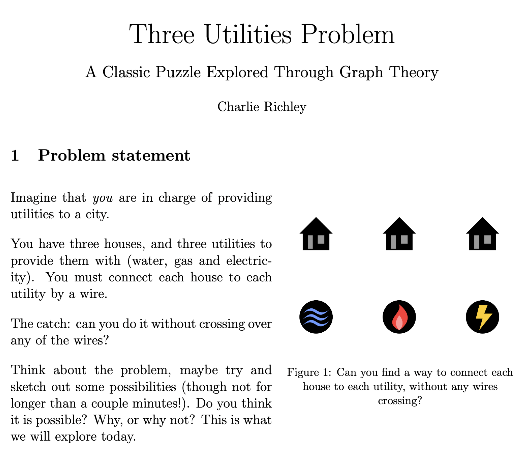

A 10-page essay I wrote in April 2026 about the famous Three Utilities Problem in Graph Theory. Entered into the Tom Rocks Maths essay competition run by the Univeristy of Oxford.

This essay is meant to be accessible, and proves all results used to solve the problem - including proving Euler's formula for connected planar graphs and deriving an inequality to show the impossibility of the problem construction.

  

